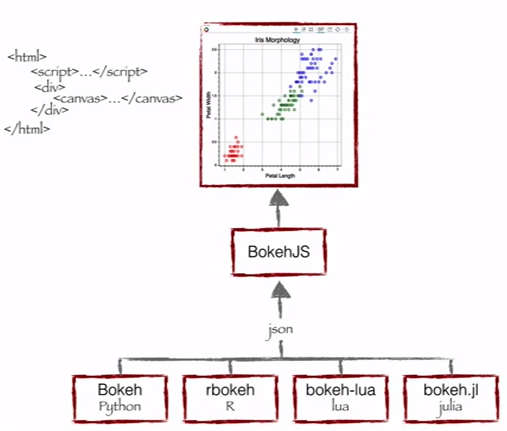

#             Data Visualization with Bokeh

&nbsp;

**Welcome to DataisLife!**  We will talk about  **The interactive Data Visualization with Bokeh**. We will go over  concepts, examples and we will do some exercises. 

 Bokeh will render the graphics using HTML and JavaScript. This way your job can be share to the business in an HTML way.

This is the Notebook concepts and Example

This is the Notebook for the Exercise Solutions

### The best resource for Bokeh is 

 *  [**Reference**](https://docs.bokeh.org/en/2.0.2/)

 <strong>By Liliana Torres</strong>

  																																						

&nbsp;